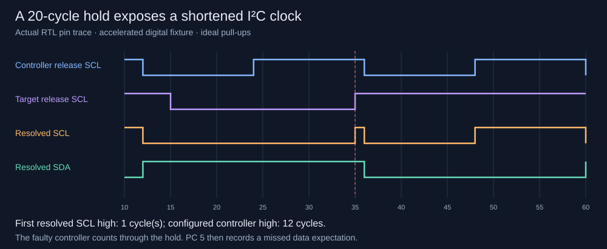

# I2C clock stretching: a reproducible failure through the chip pins

Date: 2026-09-13. This is a digital experiment against a project-authored controller
fixture with a deliberate fault, not a third-party bug report or hardware capture.
[ADR 0006](decisions/0006-i2c-stretch-experiment.md) specifies the scope.



## What the experiment establishes

A 32-word program loaded through SPI watches a configured I2C address byte,
stretches the first SCL-low period, checks each bit and generates ACK. SCL/SDA are
resolved from two independent open-drain participants with ideal pull-ups. A separate
controller state machine emits START, address A0 (7-bit address 50, write), ACK clock
and STOP. A line decoder sees only the resulting bus, not either machine's state.
The target is armed on an idle bus before the controller begins; arbitrary mid-bus
attachment is not supported by this program's initial level-based START check.

In the accelerated 12-cycle-low / 12-cycle-high fixture, every hold duration 0..48
is tested against both peers:

| Peer | Passing holds | Failing holds |
| --- | --- | --- |
| Waits for resolved SCL high | All 49: 0..48 | None |
| Counts high time while SCL is still held low | 0..19 | 20..48 |

The first failing hold is 20 cycles **within this finite sweep, timing, phase and
address**. The target pulls SCL low at peer-relative cycle 15 and releases it at 35.
The faulty controller had started counting its high phase at 24, so the bus remains
high for only cycle 35 before it drops again at 36. The programmed target cannot
sample that compressed pulse correctly and declines to acknowledge the byte.

The host-read witness reports PC 5, core cycle 562, status 1 (EXPECT timeout), one
sample, observed pins 00 and expected/masked SDA 02. Core-cycle numbering starts
at the accepted START command; the plotted cycles start when the peer begins.
Do not equate these two time origins. The controller's nominal high period is 12
cycles, but the observed first high pulse is one cycle. The accelerated fixture
is not a claim of compliant 2 MHz I2C operation.

## Nominal 100 kHz case: an address bit disappears

A second test uses 260 low / 240 high system clocks. At the unchanged 50 MHz target,
that is nominally 100 kHz before stretching. An 800-cycle target hold gives:

| Observation | Correct peer | Fault-injected peer |
| --- | --- | --- |
| First address bit on the resolved bus | 1, as programmed | 0; first bit was lost |
| Completed data/ACK clock pulses | 9 | 8 |
| Wire decoder | A0 with ACK | Misframed 41, no ninth ACK clock |
| Core terminal state | HALT, PC 31, cycle 5810 | Timeout, PC 5, cycle 1570 |
| Sampled pins at terminal event | 00 | 01: SCL high, SDA low |

The fault-injected controller advances while the line is held low, so its intended
first address clock never reaches the bus. This is distinct from the short-pulse
failure at the accelerated boundary. Both peers use the same intended address and
nominal periods; only waiting for resolved SCL differs. No FPGA/ASIC timing or
analog electrical compliance is established by these ideal digital periods.

## Verification and replay

`make test` passed nine software tests, the existing 1,024 UART byte/divisor cases,
five public-pin test groups (including this experiment), and six standalone core
groups. The I2C group performs 98 sweep transactions, two nominal-100-kHz transactions,
and one saved-file replay. All programming and witness readback go through the
public SPI interface. The decoder independently checks START, address, ACK and STOP.

The first failure's actual program words, fixture parameters, resolved bus trace
and host witness are saved in `work/i2c-witness.json`. The test reads the file back,
loads those exact words without recompiling them, and requires the new trace and
witness to match. Correct and faulty nominal-100-kHz traces are summarized as line
transitions in the same file.

`make i2c-netlist` reuses the integrated generic netlist only after checking its
RTL input hashes. Its smoke subset is holds 0, 19, 20, 24 and 48, both peers, plus
the nominal-100-kHz cases and replay: 13 transactions. This subset passes. Its
saved first failure and nominal cases match the full RTL artifact exactly.
The full 49-point sweep was not repeated on the generic netlist.

[Evidence snapshot](evidence/i2c-stretch-2026-09-13.json) records hashes and results.
The SVG above is generated by `scripts/render-i2c-witness.py` from actual trace data.
The controller/decoder's known-bus and injected-fault behavior have separate unit tests.
The host mutation baseline is now scoped to host tests to avoid redundantly running
this full sweep during unrelated mutation checks; all four host mutants remain detected.

## Reproduce and limits

With the README environment active:

```sh
make test
python scripts/render-i2c-witness.py
make i2c-netlist
```

The last command needs the previously generated matching integrated netlist. If it
is absent or stale, run `make synth-top-check` first; that target uses the I2C smoke
subset. Full and smoke results are saved separately.

The program consumes all 32 instruction slots. Payload read/write, arbitrary receive
capture, repeated START, arbitration, robust mid-transaction attachment and general
bus recovery are not implemented. A complete I2C stack and an independently maintained
controller/real board remain future validation targets.

No RTL or physical configuration changed for this milestone. Generic cell count
remains the prior source's 6,769; no new synthesis or CMOS5L physical checks ran.
The 8x4 floorplan/tooling issue and 50 MHz timing closure remain open.

Specification basis: open-drain bus resolution, stretch behavior and address format
follow [NXP UM10204, sections 3.1.1, 3.1.9 and 3.1.10](https://www.nxp.com/docs/en/user-guide/UM10204.pdf).
Stretch support is evaluated as a requirement of this configuration; it is optional
for controllers in systems without stretch-capable targets.
